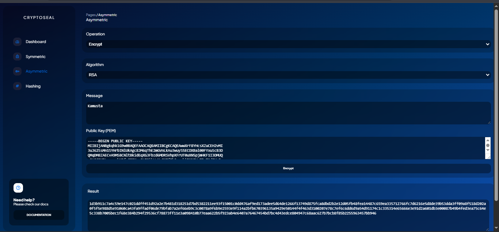
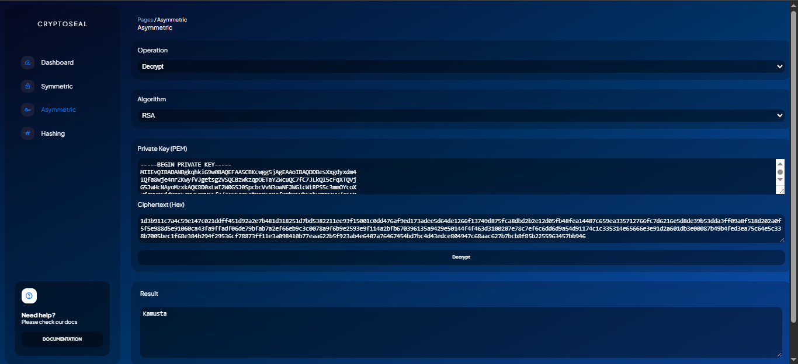
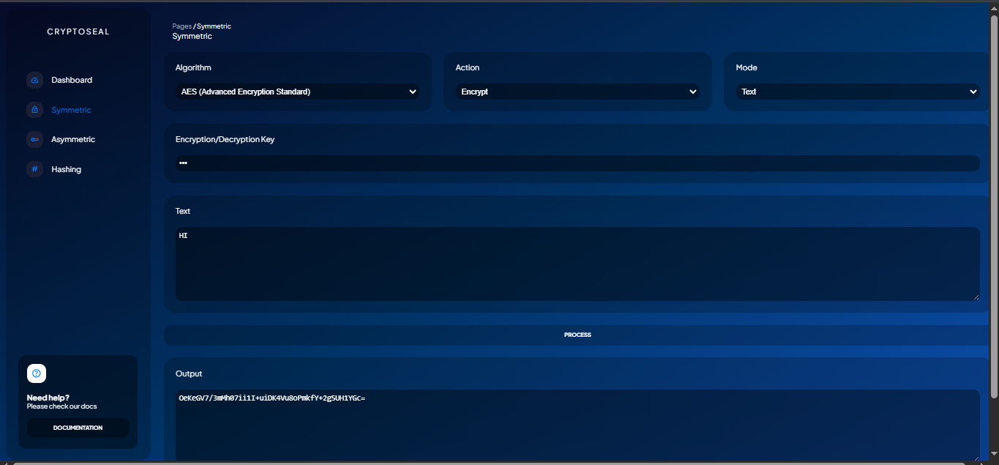
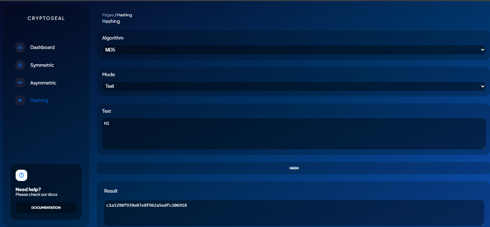

# 🔐 CryptoSeal
[pythonanywhere.com](https://gr33d.pythonanywhere.com/hash)

**Course:** CSAC 329 - Applied Cryptography
**Date:** May 24, 2025
---

## Table of Contents
- [Team Members](#team-members)
- [Introduction](#introduction)
- [Project Objectives](#project-objectives)
- [Discussions](#discussion)
- [Sample Outputs](#sample-outputs)
- [Features](#features)
- [Getting Started](#getting-started)
- [Usage](#usgae)
- [User Roles](#user-roles)
- [Python Libraries](#python-libraries)
- [License](#license)

---

## 👥 Team Members (aBitLocK Bros)
- Bata, Gian Carlo -  - (NebularEclipse, Carb0n-17)
- Calingacion, Almira - (Almira2303)
- Papa, Nikko
- Tagum, Leo - (Sauzzen)

---

## 📌 Introduction
CryptoSeal is a web-based cryptographic toolkit for encrypting, decrypting, and hashing text and files. Built to demonstrate practical cryptographic applications, it emphasizes data privacy and integrity in today's digital landscape.


## 🎯 Project Objectives
1. Implement 3 symmetric and 2 asymmetric encryption algorithms
2. Provide 4 hashing functions for text and file verification.
---

## 💬 Discussions
### 🧱 Application Architecture & UI
- **Backend:**
- Language/Framework: Python (Flask)
- Logic: Modular structure under logic/ directory
- **Frontend:**
- HTML/CSS/JS
- Sidebar-based navigation and clean UI/UX
- **UI Choice:**
- Clean, intuitive dashboard with clear separation of cryptographic tools and user/account management.

### 🔐 Implemented Cryptographic Algorithms
### 🔄 Symmetric Encryption
| Algorithm    | Library                         | Notes                          
| ------------ | ------------------------------- | ------------------------------|
| **AES**      | `cryptography`                  | Standard secure encryption (text & files) |
| **DES**      | `cryptography`                  | Legacy algorithm, included for comparison |
| **ChaCha20** | `cryptography`                  | Fast and modern stream cipher |


#### 🔐 Asymmetric Encryption
| Algorithm | Library                         | Notes                                      |
| --------- | ------------------------------- | --------------------------------|
| **RSA**   | `cryptography`                  | Secure key exchange, text encryption       |
| **ECC**   | `cryptography`                  | Efficient and modern, key-based encryption |


#### 🧾 Hashing Functions
| Function    | Library   | Notes                               |
| ----------- | --------- | ----------------------------------- |
| **SHA-256** | `hashlib` | Secure and standard                 |
| **MD5**     | `hashlib` | Fast but insecure (educational use) |
| **SHA-1**   | `hashlib` | Legacy, not secure                  |
| **SHA-512** | `hashlib` | Modern, high performance            |


---

## 🖼️ Sample Outputs
- Screenshots and code output examples will be provided for each algorithm's encryption, decryption, and hashing (text and file). See `/Screenshot/` and UI screenshots in the repository.







---

## ✨ Features
- Encrypt/decrypt text and files (symmetric & asymmetric)
- Hash text/files using standard algorithms
- Role-based authentication (Admin, User)

## 🚀 Getting Started
### ✅ Prerequisites
- Python 3.8+
- pip package manager

### Database Setup
1. Initialize the database:
   ```powershell
   flask --app app init-db
   ```
2. Schema: see `app/schema.sql` for database schema.

### Installation
1. Clone the repository:
   ```powershell
   git clone <repo-url>
   cd AC
   ```
2. Install dependencies:
   ```powershell
   pip install -r requirements.txt
   ```
3. Run the app:
   ```powershell
   flask --app app run
   ```
   
## Usage
- Open your browser: `http://127.0.0.1:5000/`
- Use the sidebar to select cryptographic tools
- Input text or upload files for encryption, decryption, or hashing

## 👤 User Roles
| Role      | Description                                                |
| --------- | ---------------------------------------------------------- |
| **Admin** | Full access: cryptographic tools + user/account management |
| **User**  | Limited access: encryption, decryption, address tools      |

🧰 Technologies Used
- Languages/Frameworks: Python, Flask, HTML, CSS, JavaScript

## 📚 Python Libraries

- **cryptography:** Core cryptographic primitives and recipes for encryption, decryption, and key management.
-  Self-contained Python package of low-level cryptographic primitives (AES, 3DES, ChaCha20, RSA, etc.).
-  Simple library for symmetric and asymmetric encryption, used for educational examples.
- **RSA:** Python library for RSA key generation, encryption, and decryption.
- **hashlib:** Standard Python library for hashing algorithms (SHA-256, SHA-1, MD5, BLAKE2).
- **pyaes:** Pure-Python implementation of AES, used for demonstration and testing.


## License
This project is licensed under the MIT License. See [LICENSE](LICENSE) for details.
